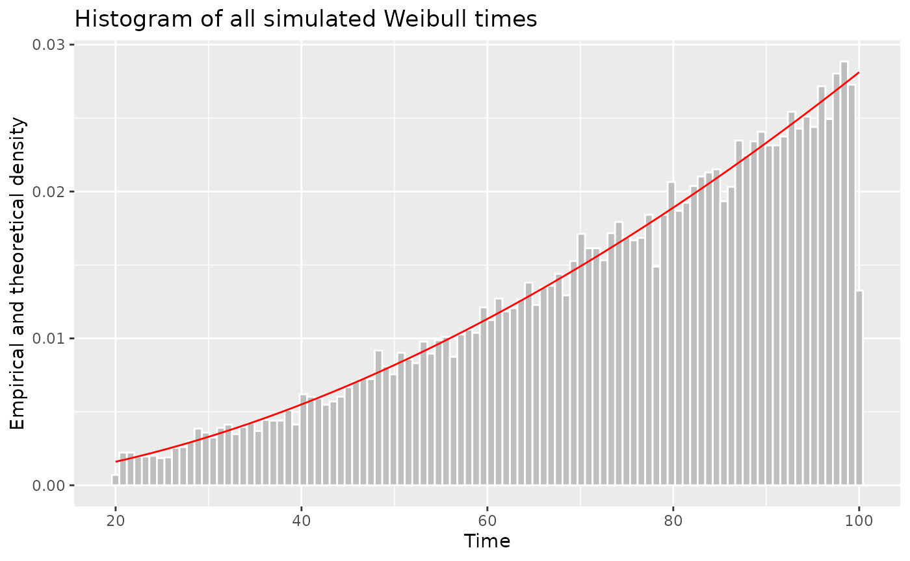

# Sampling from Weibull processes

## Simulation description

Assume a population of $K = 10^{6}$ individuals indexed by
$k \in \lbrack K\rbrack:=\{ 1,\ldots,K\}$. We will sample events from
Weibull processes over the age (time) interval $\lbrack T_{k0},T_{k1})$.
For example, $T_{k0}$ may be the age in years when person $k$ enters the
simulation, and $T_{k1}$ the age in years when that person exits the
simulation (e.g., dies from an ‘other cause’). (In practice, $T_{k1}$
would be obtained by separate point process.) Only some people will
develop clinical cancer over their simulated lifetime.

To fix a simulation scenario, let $T_{k0} = 20$ for all $k$ and
$T_{k1} \sim U(60,100)$, where $U{()}$ is the uniform distribution.

### Setup

We will use `data.table`s – but the same analysis should be obvious in
base `R`. We will use functions from three more packages, without
loading them: The `tictoc()` package will be used for a simple time
comparison between the different ways one can simulate this problem. The
`stats` package is used to generate normally and uniformly distributed
samples.

``` r
library(data.table)
library(nhppp)
```

Setup `pop`, the population `data.table`. The person specific values
T\_{k0}\$ and $T_{k1}$ are variables in `pop`.

``` r
pop <- setDT(
  list(
    id = 1:K,
    T0 = rep(20, K),
    T1 = stats::runif(n = K, min = 60, max = 100)
  )
)
setindex(pop, id)
pop
#> Index: <id>
#>               id    T0       T1
#>            <int> <num>    <num>
#>       1:       1    20 95.12126
#>       2:       2    20 61.79684
#>       3:       3    20 99.27175
#>       4:       4    20 90.76692
#>       5:       5    20 61.40517
#>      ---                       
#>  999996:  999996    20 79.90306
#>  999997:  999997    20 92.23822
#>  999998:  999998    20 96.23102
#>  999999:  999999    20 67.21445
#> 1000000: 1000000    20 64.96352
```

## The Weibull Process functions

The Weibull intensity function is

$\lambda_{k}(t) = \frac{\alpha_{k}}{\sigma_{k}}(\frac{t}{\sigma_{k}})^{\alpha_{k} - 1}$,

where $t$ is age in years. The parameters $\alpha_{k},\sigma_{k}$ are
random over the individuals in the population with
$\alpha_{k} \sim U(2.28,3.28)$, and $\beta_{k} \sim U(64,84)$.

Add these values as person-level parameters in the dataset:

``` r
pop[, `:=`(
  alpha_weibull = stats::runif(n = K, min = 2.28, max = 3.28),
  sigma_weibull = stats::runif(n = K, min = 64, max = 84)
  )]
```

A cumulative intensity function is

$\Lambda_{k}(t) = (\frac{t}{\sigma_{k}})^{\alpha_{k}}$,

with the integration constant arbitrarily set so that $\Lambda(0) = 0$.
The inverse cumulative intensity function is

$\Lambda^{- 1}(z) = \sigma_{k}\ z^{1/\alpha_{k}}$.

#### Vectorized specification of the Weibull $\lambda{()}$, $\Lambda{()}$, and $\Lambda^{- 1}{()}$

Define vectorized forms of the Weibull $\lambda{()}$, $\Lambda{()}$, and
$\Lambda^{- 1}{()}$ functions that take as default the values in `pop`.

``` r
l_weibull <- function(t, alpha = pop$alpha_weibull, sigma = pop$sigma_weibull, ...) {
  alpha/sigma * (t/sigma)^(alpha-1)
}

L_weibull <- function(t, alpha = pop$alpha_weibull, sigma = pop$sigma_weibull, ...) {
  (t/sigma)^alpha
}

Li_weibull<- function(z, alpha = pop$alpha_weibull, sigma = pop$sigma_weibull, ...) {
  sigma * z^(1/alpha)
} 
```

### Method 1: Vectorized sampling using only $\lambda{()}$

When you only know the intensity function $\lambda$, `nhppp` employs a
thinning algorithm.

One of the items needed for the thinning algorithm is a piecewise
constant majorizer function $\lambda_{*}$ such that:
$\lambda_{*}(t) > = \lambda(t)$ for all $t$ of interest.

The
[`nhppp::vdraw_intensity`](https://bladder-ca.github.io/nhppp/reference/vdraw_intensity.md)
function assumes that you will provide the majorizer function as a
matrix (`lambda_maj_matrix`). To create this matrix, split the
simulation time (here, from age 40 to age 100) in $M$ equal-length
intervals. For person $k$ and interval $m$, the element
`lambda_maj_matrix[k, m]` records a supremum of $\lambda_{k}$ over the
$m$-th interval. Any supremum will do – but the algorithm is most
efficient when you give it the least upper bound – practically, the
maximum of $\lambda(t)$ over all $t$ in the interval. For monotone
intensity functions, such as the Weibull, the maximum is at one of the
interval’s bounds. It will be at the left bound, if $\lambda$ is
decreasing, and at the right bound, if $\lambda$ is increasing.

There is a helper function in `nhppp` that generates the majorizer
matrix automatically for monotone (and possibly discontinuous) functions
and for nonmonotone continuous Lipschitz functions (functions whose
maximum slope is bounded). Even if your case is more complex, you should
be able to find a supremum that works.

This code samples in a vectorized fashion when you know only
$\lambda{()}$. It creates a majorizer matrix over $M = 5$ intervals (we
chose this arbitrarily – not trying to be fast). To let the software
know which times correspond to each of the $M$ intervals it suffices to
specify a start and stop time for each row of the majorizer matrix with
the `rate_matrix_t_min` and `rate_matrix_t_max` options. The sampling
intervals $\lbrack T_{k0},T_{k1})$for each simulated person are a subset
of the interval for which the majorizer matrix is defined, and are
specified with the `t_min` and `t_max` options. (The `atmostB` option
can be useful to speed up the sampling and minimize memory needs when
one is interested in the first event only. The smaller the value, the
faster the algorithm but you have to check that you have not specified
it to be too small. In this example, `atmostB = 5` is fine – it returns
exact solutions; but we have checked it \[not shown\]. If you do not
want to mess with it, do not use the option. The function may be already
fast enough for your needs).

``` r
tictoc::tic("Method 1 (vectorized, thinning)")
M <- 5
break_points <- seq.int(from = 20, to = 100, length.out = M + 1)
breaks_mat <- matrix(rep(break_points, each = K), nrow = K)

lmaj_mat <- nhppp::get_step_majorizer(
  fun = l_weibull,
  breaks = breaks_mat,
  is_monotone = TRUE
)

pop[
  ,
  t_thinning := nhppp::vdraw_intensity(
    lambda = l_weibull,
    lambda_maj_matrix = lmaj_mat,
    rate_matrix_t_min = 20,
    rate_matrix_t_max = 100,
    t_min = pop$T0,
    t_max = pop$T1,
    atmost1 = TRUE,
    atmostB = 5
  )
]
tictoc::toc(log = TRUE) # timer end
#> Method 1 (vectorized, thinning): 1.227 sec elapsed
```

### Method 2: Vectorized sampling using $\Lambda{()}$ and $\Lambda^{- 1}{()}$

The most efficient sampling is possible when one knows $\Lambda{()}$ and
$\Lambda^{- 1}{()}$. The `nhppp` package can sample in this case using
the
[`vdraw_cumulative_intensity()`](https://bladder-ca.github.io/nhppp/reference/vdraw_cumulative_intensity.md)
function. Here `range_t` is a matrix with information on each person’s
$\lbrack T_{k0},T_{k1})$.

``` r
tictoc::tic("Method 2 (vectorized, inversion)")
pop[
  ,
  t_inversion := nhppp::vdraw_cumulative_intensity(
    Lambda = L_weibull,
    Lambda_inv = Li_weibull,
    t_min = pop$T0,
    t_max = pop$T1,
    atmost1 = TRUE
  )
]
tictoc::toc(log = TRUE) # timer end
#> Method 2 (vectorized, inversion): 0.12 sec elapsed
```

### Comparisons

#### Simulation time-costs

The simulation time-costs that you see in this document depend on the
machine that rendered it. If you read this online, this machine is
probably some virtual server with minimal resources. If you installed
the package locally, it is probably the machine you are using to run
`R`.

1.  Method 1 (vectorized, thinning): 1.227 sec elapsed. This is the
    slower approach – but still not bad for $10^{6}$ samples! It uses
    the thinning algorithm which is very flexible – it can accommodate
    very complex time varying intensity functions. You almost always
    know $\lambda$ and can get its majorizer $\lambda_{*}$ easily and
    fast.

2.  Method 2 (vectorized, inversion): 0.12 sec elapsed. This approach is
    many times faster that the previous one, but requires
    implementations for $\Lambda$ and $\Lambda^{- 1}$.

### Simulated times

Both methods sample correctly from the specified Weibull process. There
is no approximation at play.

The QQ plots compare the simulated times with the two methods. The
agreement is excellent over this population of size $K = 10^{6}$. As $K$
increases the agreement remains excellent (not shown here - try it for
yourself). The paper in the bibliography includes in-depth comparisons.
A set of QQ plots should suffice here.

``` r
qqplot(pop$t_thinning, pop$t_inversion)
```


## Demonstrating that we simulate from the correct intensity function

Let’s fix the parameter values for all $K$ people and do a histogram of
the simulated times. They match the shape of the intensity function over
the interval $\lbrack T_{0},T_{1})$, scaled to unit area,
i.e. $\frac{\lambda(t)}{(\Lambda\left( T_{1} \right) - \Lambda\left( T_{0} \right))}$.
Run more samples to convince yourself – or also calculate the
Wasserstein distance of the empirical and theoretical distribution, as
described in the numerical analyses in the `nhppp` paper.

``` r
if(nchar(system.file(package = 'ggplot2'))>0) {
  pop2 <- setDT(list(id = 1:10000)) 
  pop2[, `:=`(
    T0 = 20, 
    T1 = 100, 
    a = 2.78, 
    s = 74
  )]
  setindex(pop2, id)
  pop2
  
  ## re-define functions to use `pop2` by default 
  ##    clunckiness of `nhppp` -- help us improve it!
  l  <- function(t, a = pop2$a, s = pop2$s, ...) a/s * (t/s)^(a-1)
  L  <- function(t, a = pop2$a, s = pop2$s, ...) (t/s)^a
  Li <- function(z, a = pop2$a, s = pop2$s, ...)  s * z^(1/a)
  
  ## get all times (full trajectories)
  Z <- nhppp::vdraw_cumulative_intensity(
      Lambda = L,
      Lambda_inv = Li,
      t_min = pop2$T0,
      t_max = pop2$T1,
      atmost1 = FALSE
    )
  
  ## ignore non-realized times 
  Z <- as.vector(Z)
  Z <- Z[!is.na(Z)]
  
  x <- seq(from = 20, to = 100, length.out = 100)
  ## normalize the hazard rate to have area 1 between 20 and 100
  y <- l(x, a = pop2$a[1], s = pop2$s[1]) / (
        L(100, a = pop2$a[1], s = pop2$s[1]) - 
        L(20, a = pop2$a[1], s = pop2$s[1])
       )
  
  
  library(ggplot2)
  ggplot(xlim = c(0, 110)) +
    geom_histogram(
      aes(x = Z, y = after_stat(density)), 
      bins = 100, 
      fill = "gray", 
      color = "white") +
    geom_line(
      aes(x = x, y = y), 
      color = "red"
    ) +
    labs(title = "Histogram of all simulated Weibull times", x = "Time", y = "Empirical and theoretical density")
}
```



## Acknowledgments

Thanks to Fernando Alarid-Escudero for providing the numerical example
in this vignette.

## Bibliography

Trikalinos TA, Sereda Y. *nhppp: Simulating Nonhomogeneous Poisson Point
Processes in R*. arXiv preprint arXiv:2402.00358. 2024 Feb 1.

Trikalinos TA, Sereda Y. *The nhppp package for simulating
non-homogeneous Poisson point processes in R*. PLoS One. 2024 Nov
21;19(11):e0311311.

Marshall AW, Olkin I. “The Weibull distribution” (p 321 in *Life
distributions* Springer, New York; 2007.

Since the publication of the paper, the syntax and options of the
`nhppp` package have evolved. To reproduce the code in the paper, you
have to install the version of `nhppp` used in the paper. Alternatively,
take a look at the vignettes, which are written to work with the current
package.
